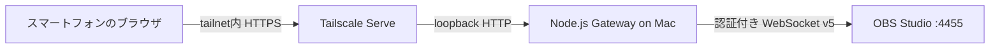

# アーキテクチャ

## 目的

初期版は次の操作に範囲を限定します。

1. 配信の開始・停止
2. 現在のプログラムシーン切り替え
3. 音声入力ごとのミュート・解除
4. OBS、配信、シーン、音声の現在状態表示

スマートフォンへOBSパスワードを渡さず、OBS WebSocketをtailnetへ直接公開せず、OBSが閉じていても操作画面とエラー状態は表示できることを要件とします。

## データフロー

Node.jsプロセスは標準で `127.0.0.1:8787` に待ち受けます。Tailscale ServeがHTTPSを終端し、loopbackへリバースプロキシします。OBS WebSocketもloopbackに維持します。

## 認証の層

1. **Tailscaleネットワークポリシー**: Serveエンドポイントへ到達できるtailnetユーザー・端末を制御
2. **コントローラー用Bearerトークン**: 状態取得とすべての操作APIを保護
3. **OBS WebSocketパスワード**: Mac側ゲートウェイからOBSへの接続だけに使用

コントローラートークンはスマートフォンの `localStorage` に保存し、`Authorization` ヘッダーでのみ送信します。URL、HTML、ログには含めません。

## バックエンド

Node.js 22の標準HTTPサーバーと標準WebSocketを使用し、ランタイム依存はありません。`ObsWebSocketClient` はobs-websocket v5 JSONプロトコルのうち、次だけを実装します。

- Hello / Identify / Identifiedハンドシェイク
- SHA-256チャレンジ認証
- Request / RequestResponse
- 接続切断と要求タイムアウト

`ObsController` が単一のOBS接続を所有し、OBS終了・再起動後に再接続します。状態取得時は次を集約します。

- `GetStreamStatus`
- `GetSceneList`
- `GetInputList`
- 各入力に対する `GetInputMute`

音声を持たない入力では `GetInputMute` が失敗するため、その失敗だけを除外し、実際にミュート操作できる入力をUIへ返します。

操作に使うOBS要求は次です。

- `StartStream` / `StopStream`
- `SetCurrentProgramScene`
- `SetInputMute`

## HTTP API

| Method | Path | Body | 目的 |
| --- | --- | --- | --- |
| `GET` | `/api/health` | — | ゲートウェイの死活・粗いOBS接続状態 |
| `GET` | `/api/state` | — | 集約した現在状態 |
| `POST` | `/api/stream` | `{ "active": true }` | 冪等な配信開始・停止 |
| `POST` | `/api/scene` | `{ "sceneName": "Main" }` | プログラムシーン切り替え |
| `POST` | `/api/input-mute` | `{ "inputName": "Mic/Aux", "muted": true }` | ミュート状態設定 |
| `POST` | `/api/obs/reconnect` | `{}` | 即時再接続 |

`/api/health` 以外は `Authorization: Bearer <token>` が必要です。

## 障害時の挙動

- OBSがなくてもHTTPサーバーとUIは起動します。
- OBS接続は一定間隔で自動再試行します。
- UIは表示中のみ2秒ごとに状態を取得します。
- 接続断時は破壊的操作を無効化します。
- 配信開始・停止はブラウザで確認し、サーバーでも現在状態を確認します。
- OBS要求は10秒、ハンドシェイクは8秒でタイムアウトします。
- API本文は16 KiBに制限します。

## 今後の拡張境界

- OBSイベントをSSEまたはWebSocketでブラウザへ配信し、ポーリングを置換
- シーン・音声入力のピン留めと表示順設定
- 録画、リプレイバッファ、トランジション、スタジオモード
- Tailscaleの信頼済みIDヘッダーによるユーザー単位認可
- 操作監査ログと通知フック
